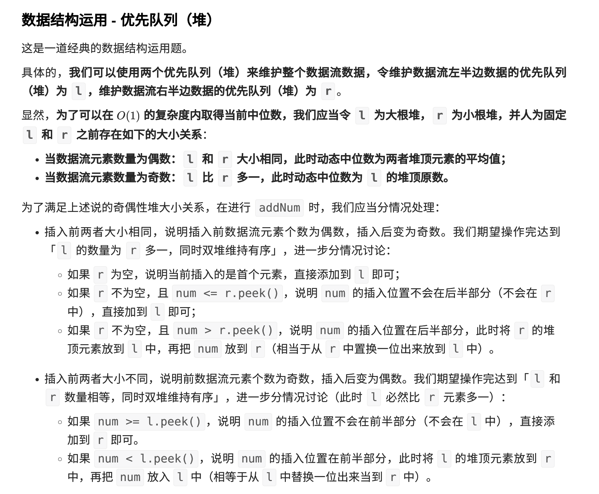

【剑指 Offer 41. 数据流中的中位数】
> https://leetcode.cn/problems/shu-ju-liu-zhong-de-zhong-wei-shu-lcof/

用到的数据结构就是堆、大顶堆、小顶堆
主要的思路是为了保证方便取中位数，把数据流分成两部分，分别放在大顶堆left、小顶堆right中，同时保证两个堆的数量差值最大为1。
这样在取中位数的时候很方便。  

大顶堆left保存排序后在左侧的数据，小顶堆right保存排序后在右侧的较大的数据。这样设置的话，两个堆顶就是咱们需要关注的中位数。  

插入的数据总数是偶数或者奇数。那就约定如果是奇数，left堆比right堆多一个元素。

为了维护两个堆的这种特性，需要对插入数据做一定的约束。

如果插入的时候，两个堆大小一样(按照之前的约定，插入到left)，判断value和两个堆顶的大小关系：

- `value > left.top` ：value应该和right堆中的元素放在一块，那就先插入right，再把right的top拿出来，插入到left。最终结果是left比right多一个元素；
- `value <= left.top` ： 说明value就应该在左半边，直接插入left；

如果left堆比right多一个元素，我们希望最终right里面增加一个元素，分为两种情况：

- `value >= right.top` ：说明value就应该在右半边，直接插入到right
- `value < right.top` ：说明value属于左半边，先插入到左半边，再把左半边的top拿出来插入到right

 

